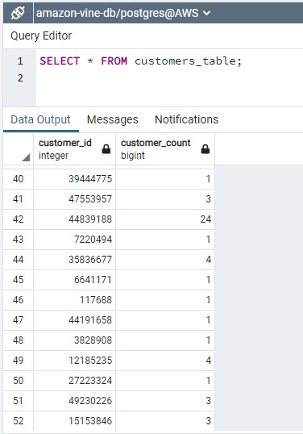

# Amazon_Vine_Analysis
 
## ETL and meta-analysis of Amazon Vine reviews with AWS, PostgreSQL, PySpark and Google Colab Notebook. 

“Learning to choose is hard. Learning to choose well is harder. And learning to choose well in a world of unlimited possibilities is harder still, perhaps too hard.”
― Barry Schwartz, The Paradox of Choice: Why More Is Less

### Project Overview

Customer feedback does not just benefit the shoppers looking for the perfect product. It is also one of the most impactful ways to help increase a business’s conversion rates, online presence, and boost a brand’s reputation. In a world where there are seemingly endless choices a finger click away, good or bad customer ratings can make or break purchases and persuade shopping decisions on consumer levels, as well as improve business practices when analyzed.

Amazon has more than two hundred million monthly visitors in the U.S., attributing to more than 37% of all online retail sales in the U.S. and accounting for over $385 billion dollars in net sales yearly. As the company continues to grow rapidly, customers increasingly make their purchase decisions with assistance from Amazon customer reviews. 

The purpose of this project was to conduct a meta-analysis of Amazon customer reviews and analyze them against those submitted through the Amazon Vine program, where select members of Amazon’s reviewing community are compensated for reviewing sample products. In this analysis, the possibility of bias towards favorable reviews from the paid Vine members in the available data is analyzed. 

Fifty data sets for different product categories from 2015 were offered to choose from for this project. In this analysis, the children’s’ toys category was selected. The initial cleaning and transforming of the data set was conducted using AWS, PostgreSQL, pgAdmin, and PySpark in Google Colab Notebook. The data analysis segment was conducted using PySpark and Google Colab Notebook.

### Resources

#### Data

* s3.amazonaws.com/amazon-reviews-pds/tsv/amazon_reviews_us_Toys_v1_00.tsv.gz

#### Software

* Amazon Web Services: RDS, S3
* Google Colab Notebook
* pgAdmin 6.8
* PostgreSQL 13.7
* PySpark 3.2.2
* Python 3.7.6

### ETL Process

The data set was extracted from an Amazon Web Services (AWS) S3 (Amazon Simple Storage Serice) using PySpark in a Google Colab Notebook and loaded back into an AWS RDS (Relational Database Service) once the applicable transformations were conducted. 

##### The data loading process:

Tables created from the data set:

##### Customers Table:

##### Products Table:

##### Review ID Table:

##### Vine table:

The extracted data set was written into DataFrames:

The DataFrames were loaded into their respective tables using pgAdmin and PostgreSQL:

##### Customer Table:

##### Products Table:

##### Review ID Table:

##### Vine Table:

### Amazon Vine Analysis

The data was filtered to show those that had more than twenty votes and were over 50% helpful. Calculations were conducted using the filtered data sets to produce the following results:

* Out of a total of 63,270 reviews in the entire dataset, 62,004 reviews (97.9%) were unpaid, and 1,266 reviews were paid (2.0%).

* Out of a total of 30,397 five-star reviews, 29,965 (98.5%) were unpaid, while only 432 (1.4%) were submitted by paid reviewers.

* Five star paid reviews as percent of total paid reviews – 34.12%. 

* Paid reviews as percent of total five star reviews -  1.42%

* Five star unpaid reviews as percent of total unpaid reviews – 48.32%

* Five star unpaid reviews as percent of total five star reviews – 98.58%

### Conclusion

Most of the reviews analyzed were submitted by unpaid participants, making up 98.5% percent of the data reviewed. Paid reviews only made up for 1.42% of the total five-star reviews analyzed, while paid five-star reviews made up for just 34.12% of the 1.42% those paid reviews analyzed. 

The final analysis infers that there is not an obvious bias towards five-star reviews from the paid Amazon Vine reviewers versus from the unpaid Amazon reviewers. Observing this data, Amazon Vine reviewers are seemingly more critical in submitting their reviews, as seen by the low percentage (34.12%) of paid five-star ratings out of the total paid reviews catergory. Conversely, unpaid five-star reviews made up for almost half (48.32%) of the total of unpaid reviews submitted, suggesting that unpaid reviwers are more likely to submit higher reviews. 

To further this analysis, it would be insightful to study the statistical distribution (mean, median and mode) of the star ratings from the paid Vine reviewers and unpaid reviewers using the full data set as well as the filtered data set. Alternatively, it would be interesting to conduct a similar study using the lowest reviews from both paid and unpaid reviewers as well. 

### Additional Analysis

Additional analysis was conducted to determine what the top rated toys were from the data set. The data was filtered to only show products with more than 2000 five star reviews that were rated as being 90% or more helpful. Out of these results, only 16 products met the filtered criteria and the item with the most numerous reviews in all catergories was found to be the Cards Against Humanity game. 

The process to obtain these results is outlined below in screenshots:

